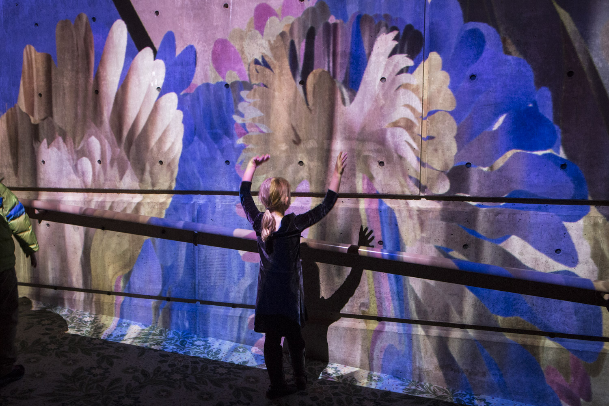
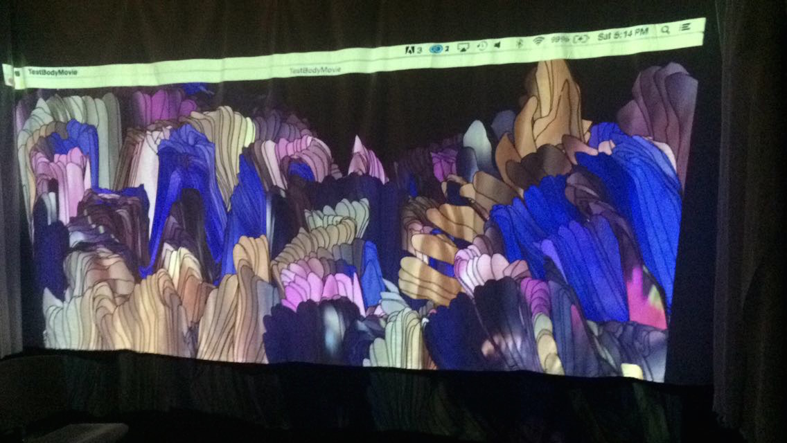

# Trails
## Interactive Projection Installation

Trails is an interactive canvas where you are the paintbrush. Trails uses Processing and a Microsoft Kinect to give audiences an exploration of their physical space by using their entire body and expressiveness to paint, play, and engage with others.

<table>
  <td></td>
  <td></td>  
</table>

## Setup
Install both **SimpleOpenNI** and **Kinect Toolkit** using the **"Add to Library" feature in Processing 2.2**.
Then, connect your Kinect and run the sketch.
